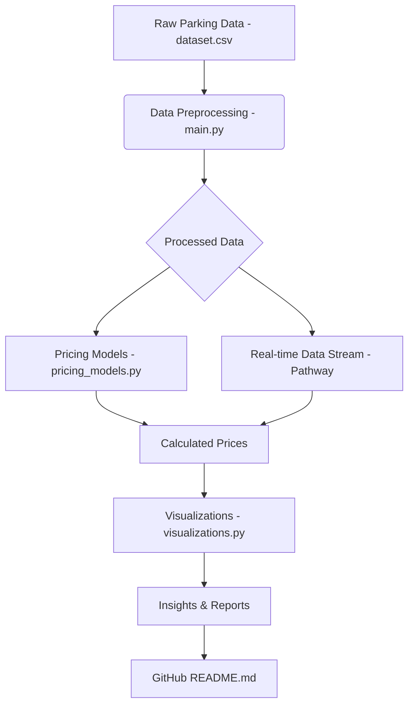

# Dynamic Parking Pricing System

## Project Overview

This project develops a dynamic parking pricing system aimed at optimizing parking utilization and revenue generation in urban environments. It addresses the inefficiencies of traditional static pricing models by implementing adaptive strategies that respond to real-time demand, traffic conditions, and special events. The system leverages data analysis, advanced pricing models, and real-time data processing to provide a flexible and responsive pricing solution for modern parking management.

## Tech Stack

*   **Python:** The primary programming language used for data processing, model development, and visualization.
*   **Pandas:** Utilized for data manipulation and analysis of the historical parking dataset.
*   **NumPy:** Used for numerical operations and mathematical computations within the pricing models.
*   **Pathway:** Employed for real-time data ingestion and simulation, demonstrating the system's ability to handle streaming data.
*   **Matplotlib:** Used for generating various visualizations, including price comparisons, occupancy trends, and queue length trends.
*   **Google Colab:** (As demonstrated by the provided notebook) A cloud-based platform for collaborative development and execution of Python code, particularly useful for data science and machine learning projects.

## Project Architecture

Below is a high-level overview of the project architecture, illustrating the flow of data and the interaction between different components.

## Detailed Architecture Explanation and Workflow

The dynamic parking pricing system is designed with a modular architecture to ensure scalability, maintainability, and clear separation of concerns. The workflow can be broken down into several key stages:

### 1. Data Ingestion and Preprocessing

The process begins with the **Raw Parking Data**, primarily sourced from `dataset.csv`. This dataset contains historical information about parking facilities, including occupancy, capacity, timestamps, geographical coordinates, queue lengths, traffic conditions, special day indicators, and vehicle types. This raw data is fed into the `main.py` script.

*   **`main.py` (Data Preprocessing):** This script acts as the initial data processor. It reads the raw `dataset.csv`, performs necessary data cleaning, transformation, and feature engineering. This includes combining date and time columns into a single `Timestamp` and preparing other features for model consumption. The output of this stage is the **Processed Data**, which is a refined and structured dataset ready for analysis and model application.

### 2. Pricing Model Application

The processed data then flows into the core of the system, where the dynamic pricing logic is applied. This stage involves two primary paths: batch processing for historical analysis and simulated real-time processing.

*   **`pricing_models.py` (Pricing Models):** This module encapsulates the business logic for the three distinct pricing models:
    *   **Model 1 (Baseline Linear Model):** Adjusts prices linearly based on occupancy and capacity.
    *   **Model 2 (Demand-Based Price Function):** Incorporates a wider array of factors such as queue length, traffic conditions, special events, and vehicle type to provide more nuanced price adjustments.
    *   **Model 3 (Competitive Pricing Model):** (Conceptual/Simplified) Aims to factor in the pricing of nearby competing parking facilities. In this project, its integration within the real-time stream is simplified, but its logic is defined to show how competitive factors would influence pricing.

    These models take the processed data as input and generate **Calculated Prices** for each parking event or scenario.

*   **Pathway (Real-time Data Stream):** Pathway is integrated to simulate a real-time data streaming environment. It ingests a subset of the processed data (from `parking_stream_for_pathway.csv`) and processes it continuously. While the complex `apply` operations for the pricing models were challenging to implement directly within Pathway's streaming context due to its functional programming paradigm, Pathway effectively demonstrates its capability for real-time data ingestion, schema definition, and timestamp processing. It prepares the data for potential real-time model inference or for direct output, contributing to the **Calculated Prices** stream.

### 3. Visualization and Reporting

Once the prices are calculated, whether through batch processing or simulated real-time streams, the results are channeled into the visualization and reporting layer.

*   **`visualizations.py` (Visualizations):** This script uses Matplotlib to generate various insightful plots based on the **Calculated Prices** and other relevant metrics from the processed data. These visualizations include:
    *   Price comparison plots for each model over time.
    *   Occupancy trends against capacity.
    *   Queue length trends.

    These plots provide immediate **Insights & Reports** into the system's performance, the behavior of the pricing models, and the overall parking dynamics. They are crucial for monitoring, validation, and communicating findings to stakeholders.

### 4. Documentation and Deliverables

Finally, all components and insights are consolidated into comprehensive documentation.

*   **GitHub `README.md`:** This file serves as the central entry point for the project, providing an overview, detailing the tech stack, presenting the architecture diagram, and explaining the detailed workflow. It also links to other relevant documentation.
*   **Capstone Report (PDF):** A comprehensive report (e.g., `capstone_report.pdf`) that delves deeper into the problem statement, methodology, implementation details, results, discussion, conclusion, and future work. This report provides a detailed academic and technical overview of the project.

This structured workflow ensures that the project is well-documented, its components are clearly defined, and its insights are effectively communicated. The combination of batch processing for historical analysis and simulated real-time streaming provides a robust framework for developing and evaluating dynamic parking pricing strategies.

## Other Relevant Documentation

*   **Capstone Project Report:** For a detailed technical and academic overview of this project, including in-depth analysis, implementation specifics, and comprehensive results, please refer to the [Capstone Project Report](capstone_report.pdf).

