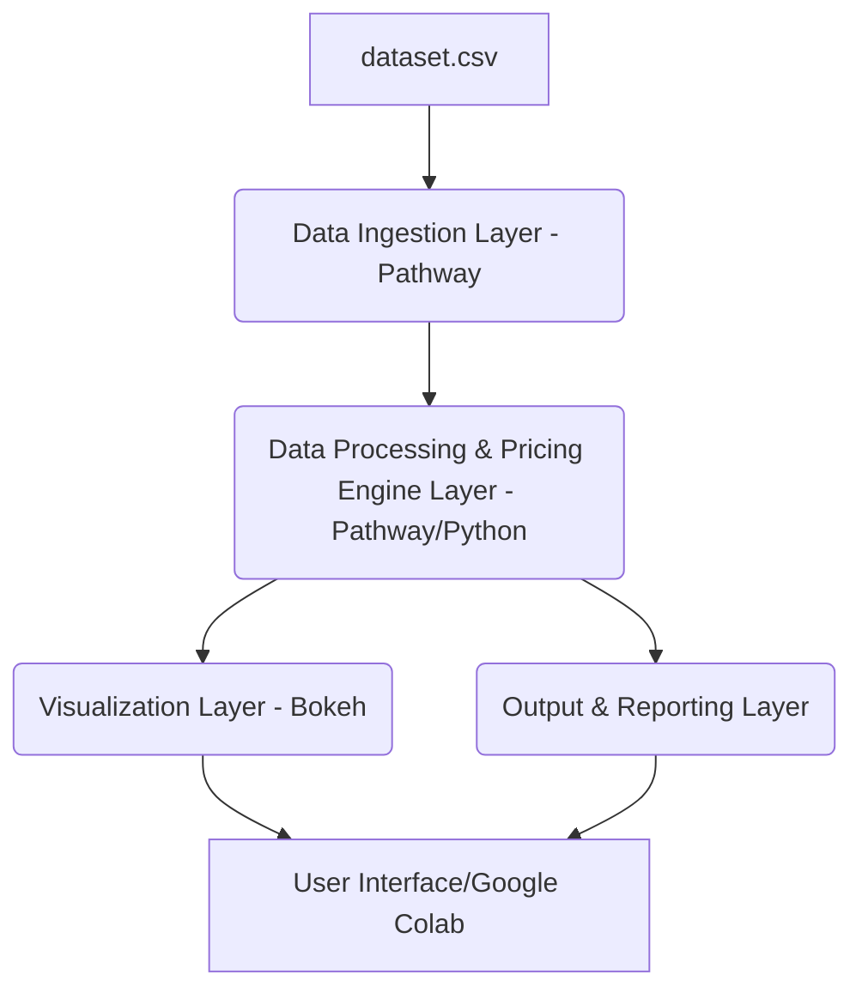

# Project Design and Methodology

## Model 1: Baseline Linear Model

This model serves as a foundational pricing mechanism, where the price of a parking space is linearly adjusted based on its current occupancy. The core formula provided is:

`Pricet+1 = Pricet + α * (Occupancy / Capacity)`

Where:
- `Pricet+1` is the price for the next time step.
- `Pricet` is the current price.
- `α` (alpha) is a coefficient that determines the sensitivity of the price to changes in occupancy rate. A higher `α` will result in more aggressive price adjustments.
- `Occupancy` is the current number of vehicles parked in the lot.
- `Capacity` is the maximum number of vehicles the parking lot can hold.

### Implementation Details:

1.  **Data Extraction**: From the `dataset.csv`, we will need to extract `Occupancy` and `Capacity` for each parking space at each time step. The `SystemCodeNumber` can be used to identify individual parking spaces.
2.  **Initial Price**: A base price of $10 will be used as the starting `Pricet` for all parking spaces.
3.  **Iterative Calculation**: The price will be calculated iteratively for each time step. For the first time step, `Pricet` will be the base price. For subsequent time steps, `Pricet` will be the `Pricet+1` from the previous calculation.
4.  **Alpha (α) Determination**: The value of `α` will need to be determined. This can be a fixed value, or it could be a parameter that can be tuned. For initial implementation, a fixed value will be chosen (e.g., 5 or 10) to observe its impact.
5.  **Output**: The model will output the calculated `Pricet+1` for each parking space at each time step.

### Considerations:

-   **Smoothness**: While this model is inherently linear, the problem statement emphasizes that price variation should be smooth and explainable, not erratic. The choice of `α` will directly influence this. A very large `α` could lead to erratic price changes.
-   **Bounds**: Although not explicitly stated for Model 1, later models mention price bounds (e.g., not more than 2x or less than 0.5x base). It would be prudent to consider implementing similar bounds even for this baseline model to prevent unrealistic pricing.
-   **Per-Parking Space Calculation**: The pricing will be calculated independently for each of the 14 parking spaces, as the `Occupancy` and `Capacity` will vary per space.

## Model 2: Demand-Based Price Function

This model introduces a more sophisticated approach to pricing by constructing a mathematical demand function. This demand function incorporates several key features from the dataset to provide a more nuanced understanding of parking demand. The example demand function provided is:

`Demand = α * (Occupancy / Capacity) + β * QueueLength - γ * Traffic + δ * IsSpecialDay + ε * VehicleTypeWeight`

Where:
- `Occupancy / Capacity` represents the occupancy rate.
- `QueueLength` is the number of vehicles waiting for entry.
- `Traffic` refers to the nearby traffic congestion level.
- `IsSpecialDay` is an indicator for holidays or events.
- `VehicleTypeWeight` is a weight assigned to the type of incoming vehicle (car, bike, or truck).
- `α`, `β`, `γ`, `δ`, `ε` are coefficients that determine the influence of each factor on demand.

After calculating the demand, it is used to adjust prices with the formula:

`Pricet = BasePrice * (1 + λ * NormalizedDemand)`

Where:
- `Pricet` is the price at time `t`.
- `BasePrice` is the initial price of $10.
- `λ` (lambda) is a coefficient that scales the impact of normalized demand on the price.
- `NormalizedDemand` is the demand value scaled to a specific range.

### Implementation Details:

1.  **Data Extraction**: In addition to `Occupancy` and `Capacity`, we will extract `QueueLength`, `TrafficConditionNearby`, `IsSpecialDay`, and `VehicleType` from `dataset.csv`.
2.  **Feature Engineering for VehicleType**: The `VehicleType` (car, bike, truck, cycle) will need to be converted into a numerical `VehicleTypeWeight`. This could be done through one-hot encoding or by assigning a numerical weight based on perceived space consumption or demand (e.g., car=1.0, truck=1.5, bike=0.5, cycle=0.3).
3.  **Feature Engineering for TrafficConditionNearby**: The `TrafficConditionNearby` (low, average, high) will also need to be converted into numerical values (e.g., low=0, average=1, high=2).
4.  **Coefficient Determination (α, β, γ, δ, ε, λ)**: These coefficients will need to be determined. This can be done through:
    -   **Heuristic Approach**: Assigning values based on domain knowledge or intuition, and then fine-tuning them through observation.
    -   **Regression Analysis**: If a target demand value or optimal price is available (which is not in the current dataset), regression could be used to learn these coefficients. Given the problem statement, a heuristic approach is more likely.
5.  **Demand Normalization**: The calculated `Demand` value needs to be normalized to ensure `Pricet` variations are smooth and bounded. This could involve scaling the demand to a range like [-1, 1] or [0, 1]. The normalization method will be crucial to prevent erratic price changes.
6.  **Price Bounds**: The problem explicitly states that price variations should be bounded (e.g., not more than 2x or less than 0.5x base). This will require implementing logic to cap the calculated `Pricet` within these limits.
7.  **Output**: The model will output the calculated `Pricet` for each parking space at each time step, considering the demand function and price bounds.

### Considerations:

-   **Demand Function Sophistication**: The example demand function is linear. The problem encourages designing more effective and sophisticated pricing strategies. This could involve non-linear relationships, interaction terms between features, or different functional forms.
-   **Tuning**: The numerous coefficients (`α`, `β`, `γ`, `δ`, `ε`, `λ`) will require careful tuning to achieve desired pricing behavior and smoothness.
-   **Interpretability**: The model should remain explainable, meaning the impact of each feature on the price should be understandable.

## Model 3 (Optional): Competitive Pricing Model

This model introduces the concept of competitive pricing by considering the prices and conditions of nearby parking spaces. This adds a layer of real-world complexity and business thinking to the pricing strategy. The core idea is to adjust the price based on the geographic proximity of competitors and their current pricing.

### Implementation Details:

1.  **Location Information**: We will use `Latitude` and `Longitude` from `dataset.csv` to calculate the geographic proximity between parking spaces. A suitable distance metric (e.g., Haversine distance) will be used.
2.  **Identifying Competitors**: For each parking space, we will need to identify its nearest competitors. This could involve setting a radius or selecting the 'N' closest parking spaces.
3.  **Competitor Price Information**: To factor in competitor prices, we would ideally need access to their real-time pricing. Since the provided `dataset.csv` only contains data for the 14 parking spaces under consideration, a simplification will be necessary. We can assume that the 'competitor prices' are the prices of other parking spaces within the dataset, or we could simulate competitor pricing based on their occupancy and other factors using the same models (Model 1 or Model 2) applied to them.
4.  **Competitive Logic**: The problem statement provides examples of competitive logic:
    -   *If your lot is full and nearby lots are cheaper → suggest rerouting or reduce price*: This implies a dynamic adjustment. If a lot is at or near capacity (`Occupancy / Capacity` is high) and nearby lots have lower prices, the current lot's price might need to be reduced to encourage rerouting, or a rerouting suggestion could be made.
    -   *If nearby lots are expensive → your price can increase while still being attractive*: If competitors are charging higher prices, the current lot has room to increase its price without losing attractiveness.
5.  **Integration with Previous Models**: Model 3 would likely build upon Model 2. The demand-based price from Model 2 would be further adjusted based on competitive factors.

### Considerations:

-   **Data Availability**: The biggest challenge for this model is the lack of explicit competitor pricing data. We will need to make assumptions or simulate this data from the existing dataset.
-   **Rerouting Logic**: Implementing rerouting suggestions would require defining thresholds for when a lot is considered 

 'overburdened' and how to identify suitable alternative lots. This might involve calculating the distance to other lots and checking their current occupancy/price.
-   **Complexity**: This model significantly increases the complexity of the pricing engine. Careful design and testing will be required to ensure the competitive logic behaves as expected and does not lead to unstable pricing.

## Real-Time Simulation with Pathway

Pathway is a crucial component for simulating real-time data ingestion and processing. The project requires using Pathway for:

-   **Ingesting data streamed with delay, preserving time-stamp order**: This implies that the `dataset.csv` will not be loaded all at once, but rather fed into the Pathway system incrementally, simulating a real-time data stream. Pathway's capabilities for handling out-of-order or delayed data will be essential.
-   **Processing features in real time**: The pricing models (Model 1, 2, and 3) will need to be implemented within Pathway's data processing pipeline. As new data points arrive, Pathway should trigger the pricing calculations and update the prices dynamically.
-   **Emitting pricing predictions continuously**: The calculated prices for each parking space at each time step will need to be continuously emitted by Pathway, which will then be consumed by the visualization component.

### Integration Details:

1.  **Pathway Setup**: We will need to set up a Pathway environment. The problem statement mentions a sample notebook will be provided with data simulation code and integration hooks. We will leverage this sample code as a starting point.
2.  **Data Ingestion**: The `dataset.csv` will be used as the source for the simulated data stream. Pathway's `pw.io.csv.read` or similar functions will be used to ingest the data, potentially with a simulated delay to mimic real-time streaming.
3.  **Pricing Logic Integration**: The Python code for Model 1, Model 2, and Model 3 will be integrated into Pathway's `transform` or `reduce` operations. This means that as new rows of data arrive, the pricing functions will be applied to calculate the updated prices.
4.  **State Management**: Pathway's ability to maintain state will be critical for `Pricet` in Model 1, where the current price depends on the previous price. Pathway's stateful computations will allow us to carry over the `Pricet` from one time step to the next.
5.  **Output Stream**: The calculated prices will form an output stream from Pathway, which will then be consumed by the visualization tool.

### Considerations:

-   **Performance**: For a real-time system, performance is key. Pathway's optimized data processing capabilities should ensure that pricing calculations are performed efficiently.
-   **Scalability**: While the current dataset is relatively small, Pathway's design for streaming data suggests it can handle larger, more complex data streams in a production environment.
-   **Debugging**: Debugging real-time data pipelines can be challenging. We will need to ensure proper logging and monitoring within the Pathway setup to identify and resolve issues.

## Real-Time Visualizations with Bokeh

Bokeh will be used to provide real-time visualizations of the dynamic pricing behavior. The problem statement suggests:

-   **Real-time pricing line plots for each parking space**: This will involve plotting the `Pricet` over time for each of the 14 parking spaces.
-   **Comparison with competitor prices**: If Model 3 is implemented, this would involve plotting the price of a parking space alongside the prices of its identified competitors.

### Integration Details:

1.  **Bokeh Setup**: We will need to set up a Bokeh server or embed Bokeh plots within the Google Colab environment.
2.  **Data Source**: The real-time pricing predictions emitted by Pathway will serve as the data source for Bokeh. This will likely involve a continuous data stream from Pathway to Bokeh.
3.  **Plotting**: Bokeh will be used to create interactive line plots. Each parking space will have its own line plot, or multiple parking spaces can be plotted on the same graph for comparison.
4.  **Real-time Updates**: Bokeh's streaming capabilities will be utilized to update the plots in real-time as new pricing data becomes available from Pathway.
5.  **Interactivity**: Bokeh's interactive features (e.g., pan, zoom, hover tools) will be enabled to allow users to explore the pricing behavior.

### Considerations:

-   **Performance**: Real-time plotting requires efficient data transfer and rendering. We will need to ensure that the data pipeline from Pathway to Bokeh is optimized.
-   **Layout and Aesthetics**: The visualizations should be clear, informative, and visually appealing. We will need to consider appropriate color schemes, labels, and legends.
-   **Scalability**: If the number of parking spaces or the data update frequency increases significantly, the visualization performance might be affected. We will need to consider strategies for handling large datasets in Bokeh.

## Overall Project Architecture

The dynamic pricing system will follow a modular architecture, enabling clear separation of concerns and facilitating future enhancements. The main components are:

1.  **Data Ingestion Layer**: Responsible for ingesting raw data, simulating real-time streams from `dataset.csv`.
    -   **Technology**: Pathway
    -   **Functionality**: Reads `dataset.csv` incrementally, handles timestamp ordering, and feeds data into the processing layer.

2.  **Data Processing and Pricing Engine Layer**: This is the core of the system, where the pricing models are implemented and executed.
    -   **Technology**: Pathway (for real-time processing) and Python (for model logic using NumPy and Pandas).
    -   **Functionality**: 
        -   **Feature Engineering**: Transforms raw data into features suitable for the pricing models (e.g., converting `VehicleType` and `TrafficConditionNearby` to numerical values).
        -   **Model Execution**: Implements and runs Model 1, Model 2, and optionally Model 3.
        -   **Price Calculation**: Computes the dynamic price for each parking space based on the selected model.
        -   **State Management**: Maintains the `Pricet` for iterative calculations and other necessary states.

3.  **Visualization Layer**: Responsible for presenting the real-time pricing data and insights to the user.
    -   **Technology**: Bokeh
    -   **Functionality**: 
        -   **Data Consumption**: Receives real-time pricing data from the Data Processing Layer.
        -   **Plotting**: Generates interactive line plots for pricing trends and comparisons.
        -   **Real-time Updates**: Dynamically updates plots as new data arrives.

4.  **Output and Reporting Layer**: Handles the final deliverables, including the Google Colab notebook and the comprehensive report.
    -   **Technology**: Google Colab (for code execution and notebook submission), Markdown/PDF (for report generation).
    -   **Functionality**: 
        -   **Notebook Generation**: Contains all the code, analysis, and visualizations.
        -   **Report Generation**: Provides detailed explanations of the models, assumptions, and results.

### Data Flow:

`dataset.csv` (simulated stream) --> **Data Ingestion (Pathway)** --> **Data Processing & Pricing Engine (Pathway/Python)** --> **Visualization (Bokeh)**

### Overall Architecture Diagram (Conceptual):

This architecture ensures that data flows efficiently through the system, from raw input to processed insights and visualizations, all while maintaining the real-time simulation requirement. The use of Pathway for data ingestion and processing, coupled with Python for model logic and Bokeh for visualization, aligns with the project requirements and best practices for building dynamic, data-driven applications.

